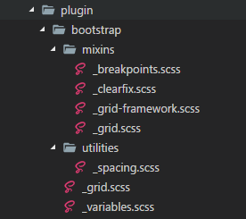
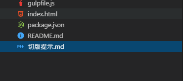
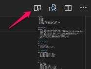
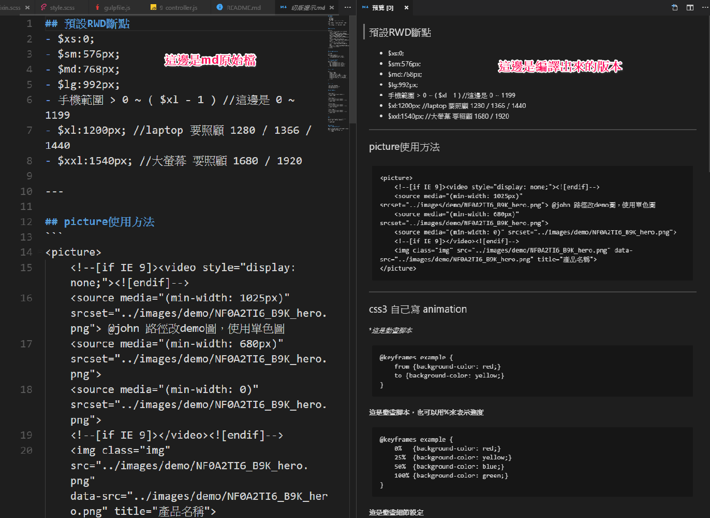

# 創造力懶人包 0.4版
- last update > **2019/06/14**
- version     > **0.4.0**
- modify by   > **Lynx**

### 已更新內容(0.4.0 - 2019/6/13)
1. 更新gulp套件版本
2. 移除Ruby，新增Gulp-sass
3. 注意!!如有編譯出錯顯示路徑上找不到scss檔案，請持續存檔到編譯過關
4. Loading page 可參考
    https://codepen.io/filipekiss/pen/yJxFo
    https://codepen.io/sandeshdamkondwar/pen/zvwvPy
5. mousewheel 可參考集田
    網址 http://www.sonygood.com/
    檔案位置 https://github.com/creatop/sonygood
6. 新增第二種slick套件Swipe(支援flex)
    參考
    https://idangero.us/swiper/
### 預計更新內容(0.3.4 - 2018/6/21)
1. 更新gulp套件版本
2. 增加Email版型，mjml使用
3. 圖片百分比mixin更新
4. js增加 [fitvidsjs](http://fitvidsjs.com/)


### 更新內容(0.3.3 - 2018/1/19)
1. 調整PNG圖片壓縮方式
2. 更新package.json至最新版
3. 壓縮大型png會速度緩慢問題，至今無解@@

### 更新內容(0.3.2 - 2017/12/15)
1. 新增bootstrap的spacing(bootstrap 3 版本)

    

    若不需要，請到 `@import "plugin/bootstrap/utilities/spacing";` 取消即可

### 更新內容(0.3.1)
1. grid system 更改為bootstrap 4
2. 預設修改為6個尺寸 (xs / sm / md / lg / xl / xxl)
3. 資料夾修正
4. 簡化scss資料夾
5. 增加 `切版提示.md`
6. 更新 `package.json` 及安裝說明 (2017/11/21)

---

<!-- ## 0.3版目標
1. 加入bootstrap 4的grid system功能，尺寸支援到5個 xs / sm / md / lg / xl / 第六個xxl ?)
2. 整理所有資料夾
3. 規範說明
4. 切版提示.md -->

## scss 結構
```
|--- style.scss 
|
|--- _setting.scss // 各式設定
|
|--- _mixin.scss // 各式mixin，會寫的未來也可以新增
|
|--- _default.scss // 基礎樣式，類似以前的_base.scss
|
|--- [ components ] // 各式元件
|
|--- [ page ]  // 個頁補充
|
|--- [ plugin ] // 套件 ex.slick / photoswipe / oocss(之前pinky寫的，有需要可以自行加入，預設為沒有)
```


## 如何觀看切版提示

1. 在使用 `vscode` 的情況下打開 `切版提示.md`
2. 按下右上角的這個鈕(這個鈕可以在右邊視窗預覽.md檔)

    
3. 就可以在右邊視窗觀看
    


## 安裝說明
1. 請先安裝 **node.js** ，安裝好後，於命令提示字元視窗輸入 `node -v`，若有出現版本號碼則代表安裝成，
4. 安裝 gulp，於命令提示字元視窗輸入 `npm -g install gulp-cli`
5. 複製 `package.json` `gulpfile.js` 到你的專案資料夾中
6. 安裝相關套件，於命令提示字元視窗輸入 `npm i`
7. 請安裝 chrome livereload套件 [傳送門](https://goo.gl/N69xSn)
8. 請先設定 gulpfile.js
   - `var imgpath = "../../assets/img/";` **css輸出後的的圖片路徑，新後台請採用預設即可**
   - `var assetspath = "../../../../assets/";` **php輸出後的的路徑，..層級請自己加，新後台請採用預設即可**
   - `var htmlfolder = "html";` **src裡面的預設html資料夾，新後台請採用預設即可**
   - `var destfolder = "application/views/en";` **輸出php的預設資料夾，注意!!此資料夾的層級要與html-output的資料夾同級**
   **別忘了語系名稱**
9. 使用 `gulp init` 進行第一次初始化，將img/js輸出(若要保持乾淨資料夾者可省略此步驟)，若是有將output ignore的版本，也可以用這個方式來跑第一次。
10. 使用 `gulp live` 開始監聽編譯


## 內容說明

### 一鍵管理
基本上你只要輸入 `gulp live` 就可以作所有事情了，工作期間請勿停止它

### 樣板功能
1. 於 `html` 資料夾中新增 `include` 資料夾
新增自己的區塊 ex. `nav.html` `header.html` `footer.html`
3. 在自己切版頁面中利用 `<!-- @@include ../include/footer.html -->` 載入

### livereload
1. 請安裝 chrome livereload套件 [傳送門](https://goo.gl/N69xSn)
2. 開啟 `gulp live` 監控
3. chrome網址列輸入 `localhost:8080` 即可預覽，本案例首頁 `http://localhost:8080/src/html-output/en/example/`
4. 不用再按F5，有任何更新它會自動更新


## gulp的任務說明

### gulp live 到底做了那些事件
```
gulp.task('live', ['server', 'watch-html']);
```
`server` 是開啟localhost，也就是之後你只要打開chrome `localhost:8080` 即可預覽，預設html輸出資料夾是 `src/html-output/`
`watch-html` 裡面放了許多監聽的事件

### 監聽scss檔並丟到css資料夾裡
```
gulp.task('sass', function() {
    gulp.src('src/scss/*.scss')
        .pipe(plumber())
        .pipe(
            sass({ outputStyle: "compressed" }) // compressed / nested
            .on("error", sass.logError)
        )
        .pipe(replace('../../src/images/', cssImgPath))
        .pipe(replace('../../images/', cssImgPath))
        .pipe(replace('../images/', cssImgPath))
        .pipe(replace('src/', 'assets/'))
        .pipe(uglifycss())
        .pipe(rename(function(path) {
            path.basename += ".min";
            path.extname = ".css";
        }))
        .pipe(gulp.dest('assets/css'));
});


```

### 監聽輸出的scss檔，輸出到css資料夾
```
gulp.task('sass', function() {
    gulp.src('src/scss/*.scss')
        .pipe(plumber())
        .pipe(
            sass({ outputStyle: "compressed" }) // compressed / nested
            .on("error", sass.logError)
        )
        .pipe(replace('../../src/images/', cssImgPath))
        .pipe(replace('../../images/', cssImgPath))
        .pipe(replace('../images/', cssImgPath))
        .pipe(replace('src/', 'assets/'))
        .pipe(uglifycss())
        .pipe(rename(function(path) {
            path.basename += ".min";
            path.extname = ".css";
        }))
        .pipe(gulp.dest('assets/css'));
});

```

### 監聽輸出的css檔，置換換路徑並壓縮後，輸出到assets的css資料夾
```
gulp.task('styles', function() {
    return gulp.src('src/css/*.css')
        .pipe(replace('../../src/images/', imgpath))
        .pipe(replace('../images/', imgpath))
        .pipe(replace('src/', 'assets/'))
        .pipe(uglifycss())
        .pipe(rename(function(path) {
            path.basename += ".min";
            path.extname = ".css";
        }))
        .pipe(gulp.dest('assets/css'));
});
```

### 若有複製google font會複製到assets資料夾
```
gulp.task('fonts', function() {
    return gulp.src('src/fonts/**/*')
        .pipe(gulp.dest('assets/fonts'));
});

```


### 將各個資料夾的js壓縮成一支 **"資料夾名稱.min.js"** 並丟到assets裡
```
gulp.task('js-folder-min', folders(pathToFolder, function(folder) {
    return gulp.src(path.join(pathToFolder, folder, '*.js'))
        .pipe(concat(folder + '.js'))
        .pipe(uglify())
        .pipe(rename(function(path) {
            path.basename += ".min";
            path.extname = ".js";
        }))
        .pipe(gulp.dest('assets/js'));
}));
```


### 壓縮圖片並丟到assets裡，並加入快取功能，避免重複動作
```
gulp.task('image', function() {
    var DEST = 'assets/img'
    gulp.src('src/images/**/*')
        .pipe(changed(DEST))
        .pipe(image({
            pngquant: true,
            optipng: true,
            zopflipng: true,
            jpegRecompress: false,
            jpegoptim: true,
            mozjpeg: true,
            gifsicle: true,
            svgo: false,
            concurrent: 10
        }))
        .pipe(gulp.dest(DEST));
});
```

### 置換html中的路徑並改副檔名丟到程式資料夾
```
// 置換共用css與js區塊
gulp.task('php-replace', function() {
    var opts = { comments: true, spare: true, quotes: true };
    return gulp.src('src/' + htmlfolder + '/**/*.html')
        .pipe(extender({ annotations: true, verbose: false }))
        .pipe(replace('../../images/', assetspath + 'img/'))
        .pipe(replace('.html\"', '.php\"'))
        .pipe(replace('../../javascripts/', assetspath + 'js/'))
        .pipe(replace('.css"', '.min.css"'))
        .pipe(replace('.js"', '.min.js"'))
        .pipe(htmlreplace(jsplugin))
        .pipe(minifyHTML(opts))
        .pipe(htmlbeautify({ indentSize: 4 }))
        .pipe(rename({
            prefix: "_",
            extname: ".php"
        }))
        .pipe(gulp.dest(destfolder));

});
```

###若是有新增js，要怎麼做
1. 先在 `src/javascripts/`新增一個資料夾，並命名 `你取的名字` *命名規則不知道的可以問問其他人*
2. 在 `gulpfile.js` 中的 `jsplugin` 變數中新增
 ```
 var jsplugin = {
        'css': assetspath + 'css/style.min.css',
        'js': assetspath + 'js/main.min.js',
        'oldie': assetspath + 'js/html5shiv.min.js',
        'js-slick': assetspath + 'js/slick.min.js',
        'js-photoswipe': assetspath + 'js/photoswipe.min.js',
        'js-daterangepicker': assetspath + 'js/daterangepicker.min.js'
    }
 ```
 3. 格式如下 `'js-daterangepicker': assetspath + 'js/daterangepicker.min.js'` 命名規則不知道的可以問問其他人


